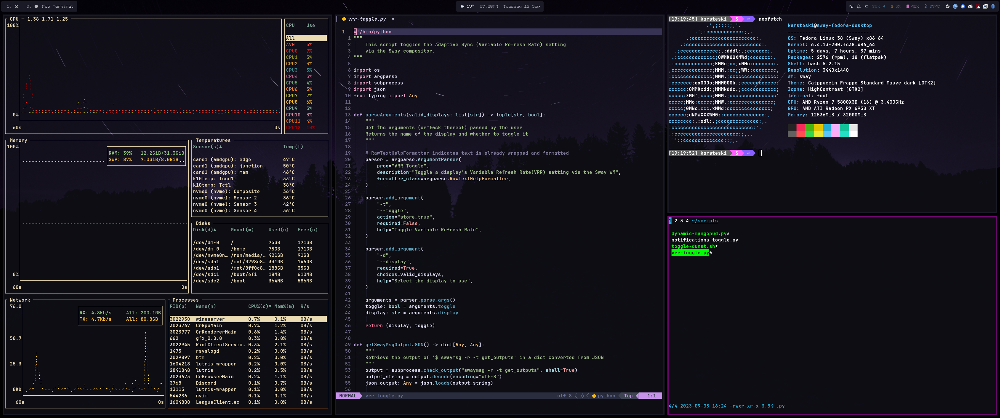

<h2 align="center">
	  
    : Sway Fedora Linux Dotfiles :
</h3>

<h3 style="text-align: center;"> 
    💾 Configuration 

</h3>

- [**Bottom**](https://github.com/ClementTsang/bottom) - TUI system monitor
- [**Dunst**](https://wiki.archlinux.org/title/Dunst) - Notification daemon
- [**Foot**](https://github.com/DanteAlighierin/foot) - Wayland terminal emulator
- [**N3**](https://github.com/jarun/nnn) - Terminal file manager
- [**Neovim**](https://github.com/neovim/neovim) - Configurable terminal text editor
- [**Rofi**](https://github.com/lbonn/rofi) - Window switcher/Application launcher
- [**Sway**](https://github.com/swaywm/sway) - Wayland compositor
- [**Swaylock**](https://github.com/swaywm/swaylock) - Wayland screen locking utility
- [**Waybar**](https://github.com/Alexays/Waybar) - Wayland bar
- 📜 And other various scripts 📜
